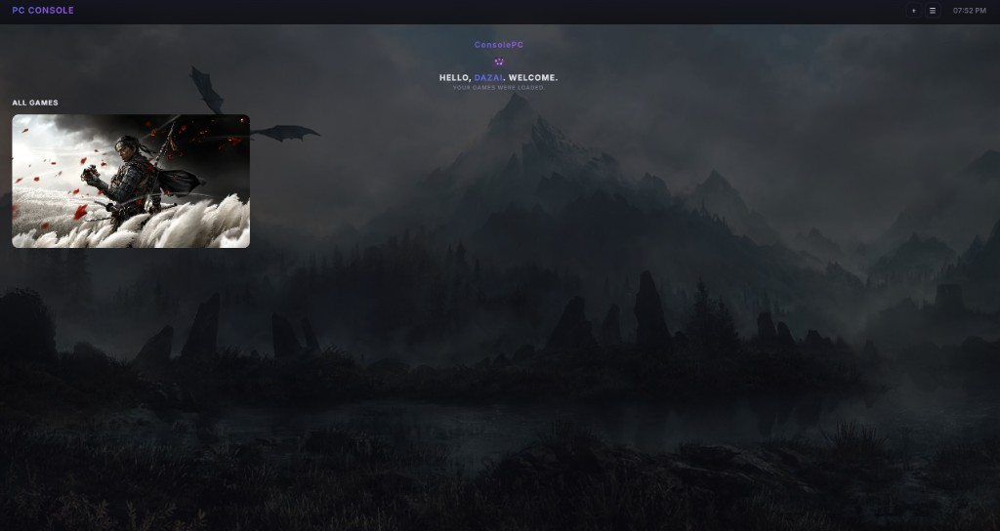

# PC Console

A fullscreen, controller-friendly PC game launcher that turns your desktop into a console-like experience.



## Features

- **Game Library** — Add games (.exe / .lnk / .bat), launch them directly from the UI
- **Cover Art** — Pick local images or auto-fetch from [RAWG](https://rawg.io/) API
- **Custom Wallpaper** — Set any image as the app background
- **Gamer Tag** — Personalized welcome screen
- **Power Controls** — Sleep, restart, and shutdown from within the app
- **System Tray** — Runs in background, restore with `Ctrl+Alt+G`
- **Start on Login** — Optional auto-launch at Windows sign-in
- **Single Instance** — Only one window at a time, second launch brings existing to front

## Tech Stack

| Layer     | Tech                    |
| --------- | ----------------------- |
| Shell     | Electron                |
| UI        | React + JSX             |
| Bundler   | Vite                    |
| Packaging | electron-builder (NSIS) |

## Getting Started

```bash
# Install dependencies
npm install

# Run in development
npm run dev

# Build for production
npm run build
```

## RAWG API Key (Optional)

To enable automatic cover art fetching, get a free API key from [rawg.io/apidocs](https://rawg.io/apidocs) and enter it in **Settings** within the app. The key is stored locally and never committed to the repo.

## Release

Pre-built Windows executables can be found in the [`release/`](release/) folder when available.

## License

MIT
